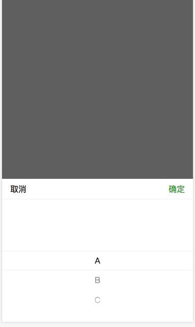
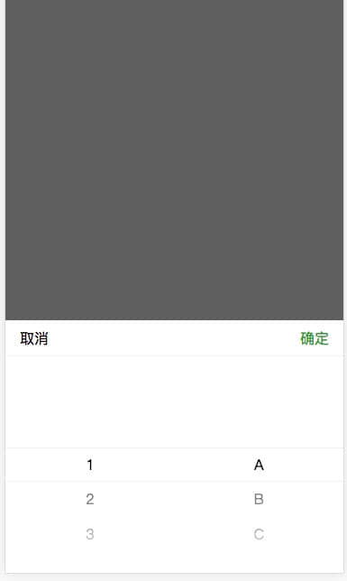

# react-picker

## Install
```
npm install gn-react-picker --save
```

## Usage
```
import Picker from 'gn-react-picker';
import 'gn-react-picker/build/css/picker.css';

<Picker data={this.state.data} onChange={(value) => { this.onChange(value); }}>
  <div>请选择</div>
</Picker>
```

## Props
|Param|Type|Default|Descript|
|----|----|----|----|
|data|array||picker数据. 建议最多三层, 城市选择器已内置数据, 可不填此项.|
|value|array||初始默认值. 由data的value值组成的数组.|
|options|object||配置项|
|[options.title]|string||标题|
|[options.cancelText]|string|取消|取消按钮|
|[options.confirmText]|string|确认|确认按钮|
|[options.type]|string||默认不填. 如果是城市选择器, 填入'cityPicker'.|
|onChange|function||点击"确认"之后的回调, 返回数组格式数据.|

## Example




```
import React, { Component } from 'react';
import Picker from 'gn-react-picker';
import 'gn-react-picker/build/css/picker.css';

// 单列
const testData1 = [
  { label: 'A', value: 'A' },
  { label: 'B', value: 'B' },
  { label: 'C', value: 'C' },  
];

// 多列
const testData2 = [
  [
    { label: '1', value: '1' },
    { label: '2', value: '2' },
    { label: '3', value: '3' },
  ],
  [
    { label: 'A', value: 'A' },
    { label: 'B', value: 'B' },
    { label: 'C', value: 'C' },
  ],
];

// 多列级联
const testData3 = [
  {
    label: '1',
    value: '1',
    children: [
      { label: 'a', value: 'a' },
      { label: 'b', value: 'b' },
    ],
  },
  {
    label: '2',
    value: '2',
    children: [
      { label: 'A', value: 'A' },
      { label: 'B', value: 'B' },
    ],
  },
];

class PickerDemo extends Component {
  constructor(props) {
    super(props);
    this.state = {
      data: testData1,
      pickerOptions: {
        type: 'cityPicker',
      }
    };
  }
  
  onChange(value) {
    
  }
  
  render() {
    return (
      <Picker data={this.state.data} onChange={(value) => { this.onChange(value); }}>
        <div>请选择</div>
      </Picker>
    );
  }
  
  // 城市选择器
  // render() {
  //   return (
  //     <Picker options={this.state.pickerOptions} onChange={(value) => { this.onChange(value); }}>
  //       <div>请选择</div>
  //     </Picker>
  //   );
  // }
}
```
